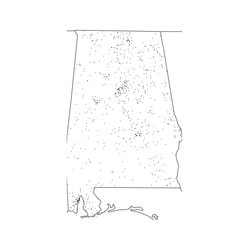

```r
knitr::opts_knit$set(root.dir = system.file("extdata",package="fars"))
```

This package contains function for loading, summarizing and mapping data from the US National Highway Traffic Safety Administration's Fatality Analysis Reporting System, which is a nationwide census providing the American public yearly data regarding fatal injuries suffered in motor vehicle traffic crashes. 

https://en.wikipedia.org/wiki/Fatality_Analysis_Reporting_System
## Usage 
###Load data for specific years
Returns a list, each element a data frame with data for individual year. 
Each row in data frame is a single fatal accident.

```r
fars_read_years(c(2013,2014,2015))
```

```
## [[1]]
## # A tibble: 30,202 × 2
##    MONTH  year
##    <int> <dbl>
## 1      1  2013
## 2      1  2013
## 3      1  2013
## 4      1  2013
## 5      1  2013
## 6      1  2013
## 7      1  2013
## 8      1  2013
## 9      1  2013
## 10     1  2013
## # ... with 30,192 more rows
## 
## [[2]]
## # A tibble: 30,056 × 2
##    MONTH  year
##    <int> <dbl>
## 1      1  2014
## 2      1  2014
## 3      1  2014
## 4      1  2014
## 5      1  2014
## 6      1  2014
## 7      1  2014
## 8      1  2014
## 9      1  2014
## 10     1  2014
## # ... with 30,046 more rows
## 
## [[3]]
## # A tibble: 32,166 × 2
##    MONTH  year
##    <int> <dbl>
## 1      1  2015
## 2      1  2015
## 3      1  2015
## 4      1  2015
## 5      1  2015
## 6      1  2015
## 7      1  2015
## 8      1  2015
## 9      1  2015
## 10     1  2015
## # ... with 32,156 more rows
```

###Summarize data for specific years

```r
fars_summarize_years(c(2013,2014,2015))
```

```
## # A tibble: 12 × 4
##    MONTH `2013` `2014` `2015`
## *  <int>  <int>  <int>  <int>
## 1      1   2230   2168   2368
## 2      2   1952   1893   1968
## 3      3   2356   2245   2385
## 4      4   2300   2308   2430
## 5      5   2532   2596   2847
## 6      6   2692   2583   2765
## 7      7   2660   2696   2998
## 8      8   2899   2800   3016
## 9      9   2741   2618   2865
## 10    10   2768   2831   3019
## 11    11   2615   2714   2724
## 12    12   2457   2604   2781
```

###Map the accidents for a single year for specific state
Use the index from state.name as first parameter.

```r
fars_map_state(1,2013)
```


